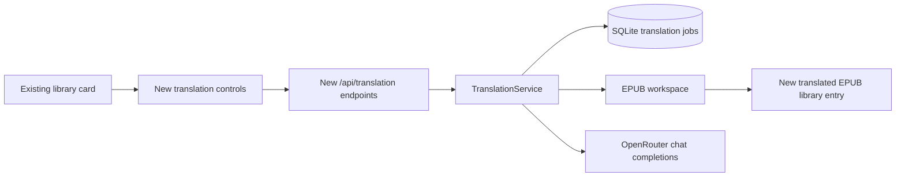

# EPUB translation through OpenRouter

## 📝 TLDR

BookSearch currently downloads, converts, and delivers books but cannot translate them. The proposed feature creates a separate Polish EPUB from a downloaded English EPUB through resumable chapter jobs using a currently free OpenRouter model, with explicit external-processing confirmation and no paid fallback. `[DOCUMENT]` `.ai/specs/product-brief.md` D02, D04, D16, D20, D22, D23

## 📝 Problem Statement

Muszkin needs a Polish EPUB from a downloaded English EPUB while preserving chapters and being able to continue after a failed external-model call. `[DOCUMENT]` `.ai/specs/product-brief.md` D02, D04, D07, D17

## 📝 Proposed Solution

Future behavior: a user starts a translation from a library EPUB, reviews the external-processing notice and effort estimate, then follows a durable per-chapter job until BookSearch creates a separate Polish EPUB. The design must preserve existing user ownership, OpenAPI-first contracts, and additive Liquibase migrations. `[PRODUCT]` `BACKWARD_COMPATIBILITY.md`

This specification delivers the core translation job only. Contextual-reference acquisition, glossary extraction, same-author verification, and the default of three persisted reference chapters are a separately deployable follow-up; the core flow has no context parameter. This keeps the first release focused on one complete job: source EPUB to translated EPUB.

OpenRouter integration uses `OPENROUTER_API_KEY` from deployment environment configuration only. The default model ID is non-secret system configuration controlled by a super-admin; it is revalidated against the live Models API before every estimate, start, and resume.

## 📝 Architecture

The service follows the existing route → service → repository boundary. It reuses `LibraryService.getFileForEntry(userId, id)` for ownership and file resolution, `ScraperConfig.dataPath` for per-user storage, JOOQ repositories for persistence, Ktor's existing HTTP client dependency, and `ActivityLogService` for audit events. It does not reuse `ConversionService`: that service holds jobs only in memory, while translation must survive an application restart.

- `OpenRouterConfig` reads only `OPENROUTER_API_KEY`, endpoint, and timeout from Ktor configuration. Never log the key, request body, source text, glossary, or completion text.
- `OpenRouterClient` wraps `GET /api/v1/models` and `POST /api/v1/chat/completions`. It accepts one explicit model ID and disables paid fallback. The selected model is eligible only when every billable text-request price used by this flow is `"0"`; missing or non-zero pricing rejects the request before source text is sent. The client records returned token usage and model ID, not completion text. [OpenRouter Models API](https://openrouter.ai/docs/api/api-reference/models/get-models), [chat completions](https://openrouter.ai/docs/api/api-reference/chat/send-chat-completion-request?explorer=true)
- `TranslationService` owns validation, chapter planning, sequential execution, retries, job lifecycle, and atomic publication. It runs one chapter at a time per job and uses a bounded semaphore shared by all jobs, initially one concurrent external request.
- `EpubTranslationWorkspace` copies the source EPUB to a job-private temporary directory, enumerates only spine XHTML resources, replaces text nodes while preserving elements, attributes, CSS, images, navigation files, and media, then rebuilds the archive. Translation prompt input is bounded to one chapter segment at a time; oversized chapters are split by block-level HTML boundaries, never arbitrary bytes.
- `TranslationJobRepository` and `TranslationChapterRepository` are the only persistence access paths for the new tables. On application startup, jobs left `queued` or `running` become `paused` with `server_restart`; no work automatically resumes.

The benchmark research supports preserving EPUB structure and persisting resumable progress, but not adding a richer editor or bilingual reader to version one. The open-source [epub-translator](https://github.com/odoucet/epub-translator) uses chunked HTML and resumable progress; [bborysenko/epub-translator](https://github.com/bborysenko/epub-translator) emphasizes retaining HTML, CSS, fonts, and images. BookSearch adopts those narrow reliability properties and defers the surrounding product complexity.

## 📝 Data Model

Add immutable Liquibase migrations; never alter prior migrations or generated JOOQ source.

### `translation_jobs`

| Field | Notes |
|---|---|
| `id` | UUID primary key, returned to the client. |
| `user_id`, `source_library_entry_id` | Required ownership link; queries always scope by `user_id`. |
| `source_book_md5`, `source_file_path` | Snapshot used for restart safety; reject resume if the source file is missing. |
| `model_id` | Exact model selected after free-price validation. |
| `status` | `queued`, `running`, `paused`, `completed`, `failed`, `cancelled`. |
| `total_chapters`, `completed_chapters`, `failed_chapter_index`, `error` | User-visible progress and safe resume point. |
| `estimated_input_tokens`, `actual_input_tokens`, `actual_output_tokens` | Estimate and non-content usage record. |
| `workspace_path`, `output_library_entry_id` | Private work directory and published result. |
| `created_at`, `updated_at`, `completed_at` | ISO-8601 timestamps. |

### `translation_chapters`

One row per reading-order chapter resource: `job_id`, `chapter_index`, `href`, `status`, `attempts`, input/output token counts, error, and timestamps. Store no source or translated prose in SQLite; translated resource files remain only in the job workspace until the EPUB is published.

On successful rebuild, calculate the output file hash, insert a new `books` row using that hash as its identifier, and add a new `user_library` EPUB entry for the same user. Copy safe source metadata, set language to `pl`, and append a visible translated-title suffix. The original library record is never modified. If publication fails, retain the paused workspace and do not create a partial library entry.

`system_config.translation_default_model` stores the non-secret default model. The API key remains exclusively in the deployment environment, never in SQLite, user settings, API responses, or logs.

## 📝 API Contracts

All routes require JWT authentication and use owner-scoped repository queries. Add endpoints to `backend/src/main/resources/openapi/api.yaml`, then regenerate TypeScript clients; do not edit `frontend/src/api/generated/` by hand.

| Endpoint | Contract |
|---|---|
| `GET /api/translation/models` | Returns currently free text models with `id`, display name, context length, and rate-limit metadata when available. It returns no provider credentials. |
| `GET /api/translation/{libraryId}/estimate` | Validates owned, downloaded EPUB and current default model. Returns chapter count, estimated input tokens, indicative duration category, free-endpoint-limit warning, and selected model. Returns `422` when configuration, format, or free eligibility fails. |
| `POST /api/translation/{libraryId}` | Body: `{ externalProcessingConfirmed: true }`. Revalidates estimate preconditions, requires confirmation, creates a durable job, and returns `202 { jobId, status: "queued" }`. Repeated active request for the same source returns `409`. |
| `GET /api/translation/jobs/{jobId}` | Returns owner-scoped status, chapter progress, selected model, token totals, resumability, and safe error text. |
| `POST /api/translation/jobs/{jobId}/resume` | Owner-only. Allowed only for `paused` or retry-exhausted `failed` jobs with source/workspace present; rechecks zero pricing and queues the first incomplete chapter. |
| `POST /api/translation/jobs/{jobId}/cancel` | Owner-only. Cancels queued or paused work, deletes the workspace, and never deletes a published output. |
| `GET /api/admin/translation/config` | Super-admin only; returns default model ID and live eligibility state. |
| `PUT /api/admin/translation/config` | Super-admin only; body `{ defaultModelId }`. Validates the chosen live model is text-capable and currently free before persisting `system_config.translation_default_model`. |

The external-processing notice is rendered exactly before the start confirmation: “Treść EPUB-a oraz wybrany glosariusz i fragmenty kontekstu zostaną wysłane do OpenRouter w celu tłumaczenia”. For this core slice no context is sent, so the UI appends “W tej wersji nie wybrano materiałów kontekstowych.” The confirmation checkbox cannot be preselected.

## 📝 UI/UX

- Add a **Translate to Polish** action only to library cards with a downloaded EPUB. It opens a dialog, not an immediate API call.
- The dialog loads the estimate, shows selected model, chapter count, token estimate, indicative duration, free-endpoint warning, the external-processing notice, and an unchecked confirmation. The start button remains disabled until loading succeeds and confirmation is checked.
- After `202`, the library card shows a compact progress state with completed/total chapters and a link to job details. Poll `GET /api/translation/jobs/{jobId}` at the existing five-second cadence and stop on terminal or paused status.
- A paused or failed job shows the sanitized failure reason and **Resume** action. A completed job refreshes the library list; the new Polish EPUB appears as a separate card and uses existing download and delivery actions.
- The admin view adds a translation-model section available only to super-admins. It shows the configured model and current free/ineligible state. A failed model refresh does not erase saved configuration.
- Keyboard focus enters the dialog heading, the checkbox has an explicit label, status uses `aria-live="polite"`, and errors do not rely on color alone.

## 📝 Edge Cases & Failure Scenarios

| Situation | Behavior |
|---|---|
| No `OPENROUTER_API_KEY` or no configured model | Estimate and start return `422`; UI states that translation is not configured. |
| Model disappears or becomes paid | No source text is sent; job start/resume is rejected or paused with `model_no_longer_free`. |
| Rate limit, timeout, or transient 5xx | Retry the chapter with bounded backoff up to three total attempts. |
| Third failed attempt | Mark job `paused`, retain workspace, and require explicit resume; never switch models or spend money. |
| Invalid/DRM/unreadable EPUB or no spine XHTML | Reject before job creation with a safe validation message. |
| Model output cannot map to the requested segment | Count the attempt as failed; never write unvalidated prose into the EPUB. |
| Server restart | Convert queued/running jobs to `paused`; user resumes explicitly. |
| Source file deleted or library ownership lost | Resume returns `404`/`422`; workspace stays until cancellation or retention cleanup. |
| Rebuild or hash/publication fails | Keep job paused and preserve original EPUB; no partial output appears in library. |

## 📝 Risks & Impact Review

- **External text transfer:** source prose leaves the self-hosted instance only after the explicit confirmation. The API key is environment-only; logs and database records contain no prose or secrets. D06 and D20 remain binding.
- **Free-model availability:** price and rate limits are live external state. Revalidation occurs on estimate, start, and resume; the product deliberately accepts a paused job over paid fallback (R05, R07, R08).
- **EPUB fidelity:** an EPUB round trip may expose malformed HTML or unsupported resources. Preserve archive resources verbatim unless they are an eligible spine XHTML resource; validation compares source and output reading-order chapter counts before publication.
- **Compatibility:** this is additive API, schema, runtime configuration, and SPA behavior. Migrations are forward-only; removal of a translation job never removes source or output library files. Rollback consists of disabling translation through configuration and leaving existing completed outputs readable.
- **Product boundary:** this specification does not implement contextual-reference discovery, glossary creation, PDF OCR, an editor, or public sharing. Those require a separate spec and must not be smuggled into this slice.

## 📝 Decisions in play

- Relied on: R01, R02, R05–R08; N01–N03; D02, D04–D07, D09, D16–D17, D20–D23. Owner: muszkin.
- Deferred without superseding: R03, R04, R09 and D13–D15, D18–D19 belong to the contextual-reference follow-up, not this implementation.

## 📋 Phasing

### Phase 1 — Configurable, safe translation boundary

Introduce environment-only credentials, super-admin default-model configuration, free-price validation, and the estimate endpoint. This ships a usable configuration and preflight surface without sending book text.

### Phase 2 — Durable EPUB translation job

Introduce persisted job/chapter state, EPUB workspace processing, OpenRouter calls, retries, resume, atomic publication, and owner-scoped API contracts. This ships a backend-complete source-to-output workflow.

### Phase 3 — Library workflow

Add the translation dialog, progress polling, paused-job resume, and admin model configuration UI. This makes the backend workflow usable without changing existing conversion or delivery behavior.

## 📋 Implementation Plan

### Phase 1

1. Add `OPENROUTER_API_KEY` and non-secret translation configuration to `application.yaml`, `.env.example`, Compose, and deployment documentation; add configuration parsing tests proving no key is logged or exposed.
2. Add the OpenRouter client and model repository/service boundary; mock Models API responses to test zero-price, missing-price, non-text, and unavailable-model rejection.
3. Add additive `translation_default_model` system configuration access plus super-admin OpenAPI routes and generated-client regeneration; test authorization and invalid model rejection.
4. Add owner-scoped estimate route and frontend preflight dialog shell; test EPUB-only validation, notice visibility, disabled confirmation, and error states.

### Phase 2

5. Add sequential Liquibase migrations for `translation_jobs` and `translation_chapters`, extend JOOQ code generation includes, and implement owner-scoped repositories with migration tests.
6. Implement EPUB workspace enumeration, segment mapping, XML-safe replacement, archive rebuild, and chapter-count verification using fixture EPUBs with inline formatting, images, and malformed input tests.
7. Implement `TranslationService` with a single shared worker limit, persisted transitions, three-attempt retry policy, restart-to-paused recovery, cancel cleanup, and resume validation; unit-test every transition.
8. Implement OpenRouter chapter calls and response validation, recording only model and token metadata; add mock-server tests for timeout, 429, 5xx, malformed output, and zero paid fallback.
9. Implement atomic publication as a new Polish `books` plus `user_library` EPUB entry and activity log; integration-test source ownership, output visibility, failed publication rollback, download, and delivery.
10. Add translation job OpenAPI routes and generated clients; API-test `202`, owner isolation, `409`, `422`, pause/resume, cancel, and restart recovery semantics.

### Phase 3

11. Add Pinia translation-job state and polling, then library-card dialog and progress/resume UI; component-test focus, checkbox gating, progress, failure, and completed-library refresh.
12. Add super-admin translation model configuration UI; test non-admin denial, ineligible-model feedback, and saved configuration state.
