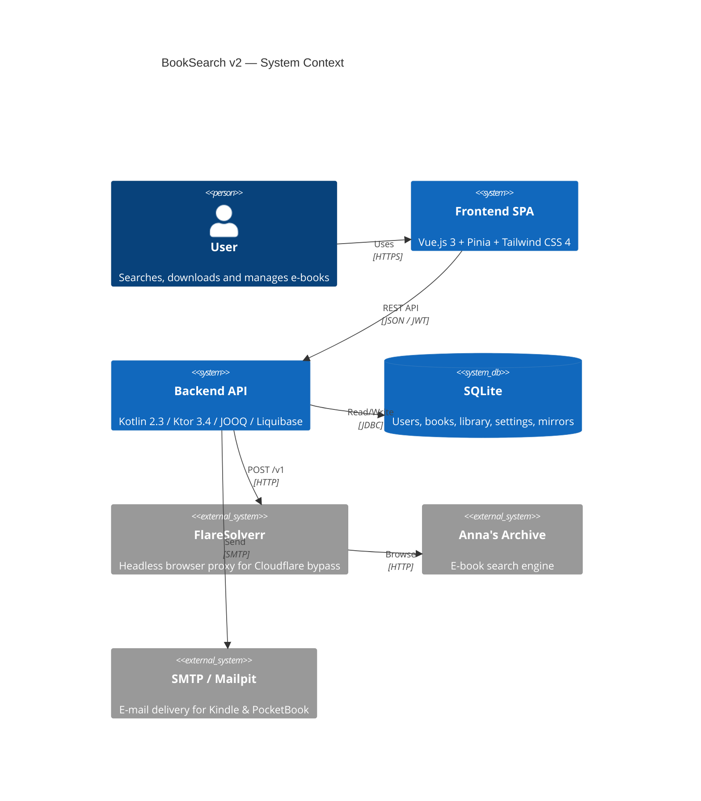
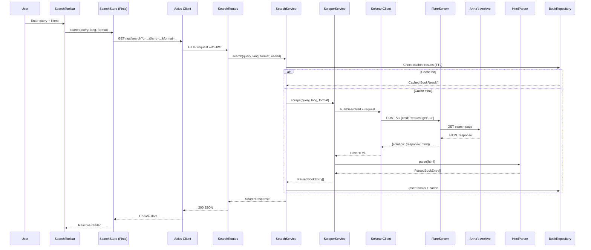
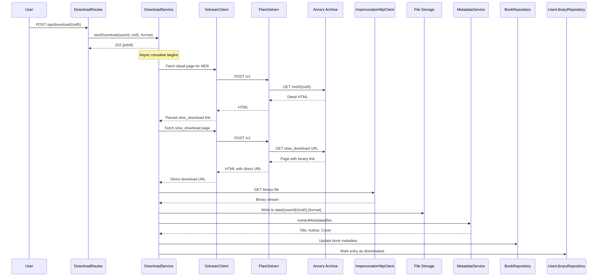
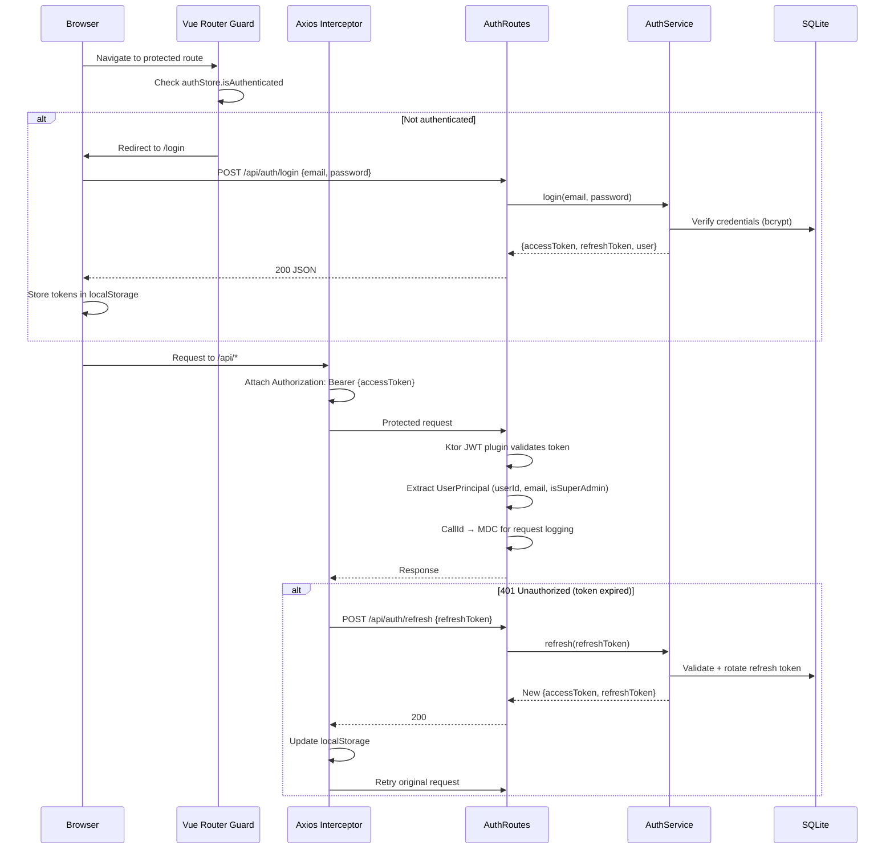

# Architecture

## System Overview

BookSearch v2 is a self-hosted application for searching, downloading, and managing e-books from Anna's Archive. The backend (Kotlin/Ktor) serves both the REST API and the Vue.js SPA (embedded in the fat JAR). All browser-automation tasks are delegated to FlareSolverr to bypass Cloudflare protection.

## Data Flow — Search

When a user performs a search the request travels through several layers before results are returned.

## Data Flow — Download

Downloading a book is a multi-step process that involves resolving the detail page, finding the slow-download link, fetching the binary, and extracting metadata.

## Authentication Flow

The application uses JWT-based authentication with access/refresh token rotation and optional password-reset via SMTP.

## Component Diagram

### Backend Package Structure

```mermaid
graph TD
    subgraph "api/"
        AuthRoutes
        AdminRoutes
        SearchRoutes
        LibraryRoutes
        DownloadRoutes
        ConvertRoutes
        DeliverRoutes
        SettingsRoutes
        MirrorRoutes
        HealthRoute
        OpenApiRoutes
    end

    subgraph "service/"
        AuthService
        SearchService
        ScraperService
        DownloadService
        LibraryService
        ConversionService
        DeliveryService
        MetadataService
        MirrorService
        CalibreWrapper
    end

    subgraph "repository/"
        UserRepository
        RefreshTokenRepository
        PasswordResetTokenRepository
        SystemConfigRepository
        BookRepository
        UserLibraryRepository
        UserSettingsRepository
        MirrorRepository
        DownloadJobRepository
        DeliveryRepository
    end

    subgraph "infrastructure/"
        DatabaseFactory
        SolvearrClient
        ImpersonatorHttpClient
        HtmlParser
        RequestLoggerPlugin
        ScraperConfig
        MirrorConfig
    end

    AuthRoutes --> AuthService
    AdminRoutes --> AuthService
    SearchRoutes --> SearchService
    LibraryRoutes --> LibraryService
    DownloadRoutes --> DownloadService
    ConvertRoutes --> ConversionService
    DeliverRoutes --> DeliveryService
    SettingsRoutes --> UserSettingsRepository
    MirrorRoutes --> MirrorService

    SearchService --> ScraperService
    SearchService --> BookRepository
    ScraperService --> SolvearrClient
    ScraperService --> MirrorService
    DownloadService --> SolvearrClient
    DownloadService --> ImpersonatorHttpClient
    DownloadService --> MetadataService
    ConversionService --> CalibreWrapper
    DeliveryService --> UserSettingsRepository
    MirrorService --> MirrorRepository

    SolvearrClient --> ScraperConfig
    ImpersonatorHttpClient --> ScraperConfig
    DatabaseFactory --> UserRepository
    DatabaseFactory --> BookRepository
```

### Frontend Architecture

```mermaid
graph TD
    subgraph "views/"
        LoginView
        RegisterView
        SearchView
        LibraryView
        SettingsView
        AdminView
    end

    subgraph "components/"
        subgraph "layout/"
            MainLayout
            AuthLayout
            AppSidebar
            AppLogo
            MobileDrawer
        end
        subgraph "search/"
            SearchToolbar
            SearchResultCard
            SelectionPanel
        end
        subgraph "library/"
            LibraryTable
            BookActions
        end
        subgraph "admin/"
            UserTable
            InviteUserForm
            ChangeUserPasswordModal
        end
        subgraph "settings/"
            DeviceSettingsForm
        end
        subgraph "base/"
            BaseButton
            BaseInput
            BaseSelect
            AlertMessage
            EmptyState
        end
    end

    subgraph "stores/"
        AuthStore
        SearchStore
        SelectionStore
        LibraryStore
        SettingsStore
        AdminStore
    end

    subgraph "api/"
        AxiosClient
        subgraph "generated/"
            GenAuthService[AuthService]
            GenSearchService[SearchService]
            GenLibraryService[LibraryService]
            GenDownloadService[DownloadService]
            GenConvertService[ConvertService]
            GenDeliverService[DeliverService]
            GenSettingsService[SettingsService]
            GenAdminService[AdminService]
        end
    end

    SearchView --> SearchToolbar
    SearchView --> SearchResultCard
    SearchView --> SelectionPanel
    LibraryView --> LibraryTable
    AdminView --> UserTable
    AdminView --> InviteUserForm

    SearchStore --> GenSearchService
    LibraryStore --> GenLibraryService
    AuthStore --> GenAuthService
    SettingsStore --> GenSettingsService
    AdminStore --> GenAdminService

    GenSearchService --> AxiosClient
    GenLibraryService --> AxiosClient
    GenAuthService --> AxiosClient
```

